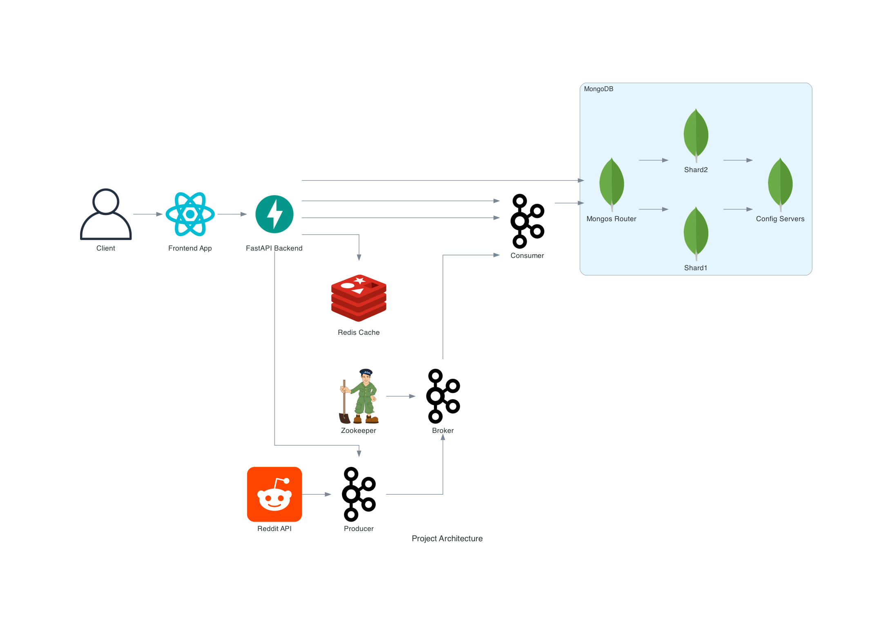

# MongoDB_Shared Project 

## Overview  
This project leverages modern technologies to create a scalable, efficient, and robust system for real-time data processing and user interaction. It integrates multiple services and tools to fetch, process, store, and display data seamlessly.  

---

## Features  
- **Frontend**: Interactive and user-friendly interface built with React.js.  
- **Backend**: FastAPI-based backend for handling API requests .  
- **Real-Time Data Processing**:  
  - Fetches posts and comments from the Reddit API.  
  - Streams and processes data efficiently using Apache Kafka.  
- **Caching**: Redis caching for ultra-fast data retrieval.  
- **Database**: MongoDB with a sharded architecture for horizontal scalability and high availability.  

---

## Architecture  

  

### **Components**:  
1. **Frontend**:  
   - Built with React.js to provide an interactive and responsive user experience.  
   - Communicates with the backend for data visualization and interaction.  

2. **Backend**:  
   - Powered by FastAPI for a lightweight and performant API layer.  
   - Handles business logic and API endpoints for the frontend and internal services.  

3. **Data Pipeline**:  
   - **Reddit API**: Fetches real-time data.  
   - **Kafka**:  
     - **Producer**: Publishes fetched data to Kafka topics.  
     - **Broker**: Manages message distribution.  
     - **Consumer**: Processes and forwards messages to the database.  

4. **Caching Layer**:  
   - Redis is used for caching frequently accessed data to reduce latency and improve performance.
   - It works by retreving the data requested by the front-end if not already existed from the mongo data base  

5. **Database**:  
   - MongoDB with sharding for distributed and scalable data storage.
   - It splits the data fetched by Reddit API and store it in differant shards . When needed , the data is retreived .
     When one of the shards turn down , it is replaced by another one until it runs again maintening availibility of the data
   - **Components**:  
     - **Shards**: Partitioned data storage for scalability.  
     - **Mongos Router**: Routes queries to the appropriate shards.  
     - **Config Servers**: Maintains metadata for shard configuration.  

---

## Getting Started  

### Prerequisites  
- Docker  
- Python 3.9+  
- Node.js 14+  
- MongoDB, Kafka, and Redis services running (can be set up using Docker).  

---

### Installation  

1. Clone the repository:  
   ```cmd  
   git clone https://github.com/Oussamaend34/MongoDB_Sharded.git  
   cd MongoDB_Shared
2. Run the docker compose:  
   ```cmd  
   docker-compose up -d
3. Access the web interface:  
   localhost:5173
