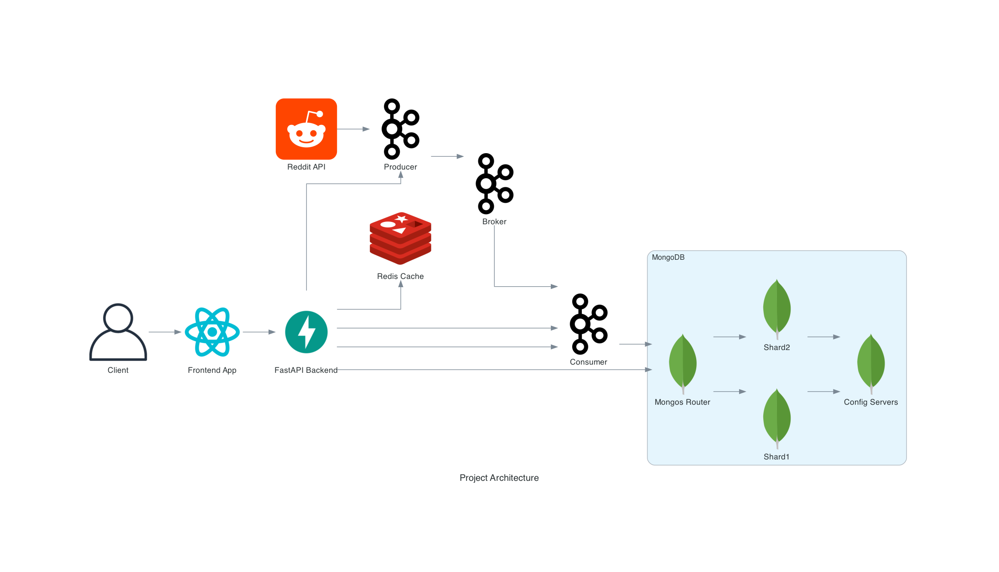
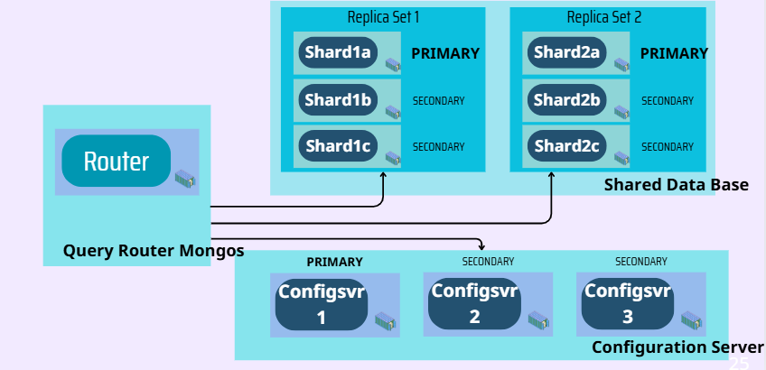

# MongoDB_Shared Project 

## Overview  
This project leverages modern technologies to create a scalable, efficient, and robust system for real-time data processing and user interaction. It integrates multiple services and tools to fetch, process, store, and display data seamlessly.  

---

## Features  
- **Frontend**: Interactive and user-friendly interface built with React.js.  
- **Backend**: FastAPI-based backend for handling API requests .  
- **Real-Time Data Processing**:  
  - Fetches posts and comments from the Reddit API.  
  - Streams and processes data efficiently using Apache Kafka.  
- **Caching**: Redis caching for ultra-fast data retrieval.  
- **Database**: MongoDB with a sharded architecture for horizontal scalability and high availability.  

---

## Project Architecture  

  

### **Components**:  
1. **Frontend**:  
   - Built with React.js to provide an interactive and responsive user experience.  
   - Communicates with the backend for data visualization and interaction.  

2. **Backend**:  
   - Powered by FastAPI for a lightweight and performant API layer.  
   - Handles business logic and API endpoints for the frontend and internal services.  

3. **Data Pipeline**:  
   - **Reddit API**: Fetches real-time data.  
   - **Kafka**:  
     - **Producer**: Publishes fetched data to Kafka topics.  
     - **Broker**: Manages message distribution.  
     - **Consumer**: Processes and forwards messages to the database.  

4. **Caching Layer**:  
   - Redis is used for caching frequently accessed data to reduce latency and improve performance.
   - It works by retreving the data requested by the front-end if not already existed from the mongo data base
---

## Database Architecture  
   When dealing with large-scale data systems, having a robust and scalable database architecture is essential.
   Our project implements a sharded MongoDB cluster designed for high performance and distributed scalability , All of this
   is guaranteed through the following Architecture :
   
     

The Architecture is composed from three componanats :
  1. Query Router (Mongos) :      
     This the service that manages the request comming from the Redis layer to retrieve data , Or from the Back-end layer to
     store the data retrived using Reddit API
  3. Replica Sets :         
     We used two ReplicaSets to divide the storage load between them. Additionally, we ensured that each ReplicaSet possesses three shards to guarantee the availability of our database.
  5. Config Servers :
     We configured the main configuration server (configsvr1) to store our metadata. We also configured two additional servers as a backup plan to maintain high availability.         

To ensure that our architecture can be run on different operating systems or environments, the entire architecture is deployed using Docker containers and configured with a combination of Docker Compose file and Bash scripts.

---

## Getting Started  

### Prerequisites  
- Docker  
- Python 3.9+  
- Node.js 14+  
- MongoDB, Kafka, and Redis services running (can be set up using Docker).  

---

### Installation  

1. Clone the repository:  
   ```cmd  
   git clone https://github.com/Oussamaend34/MongoDB_Sharded.git  
   cd MongoDB_Shared
2. Run the docker compose:  
   ```cmd  
   docker-compose up -d
3. Access the web interface:  
   localhost:5173
